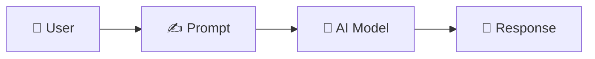
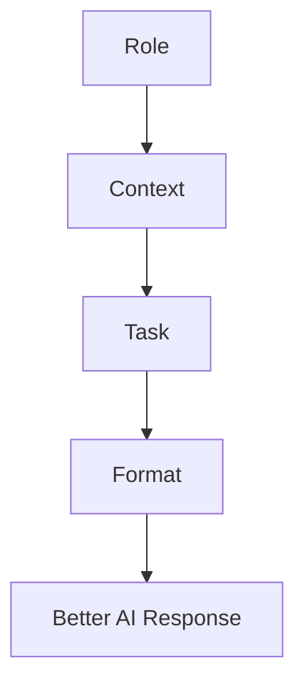
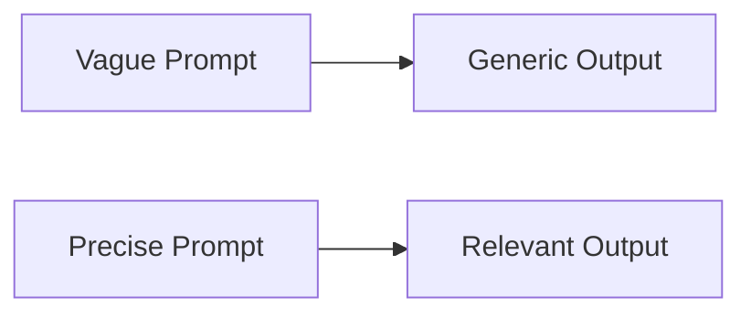
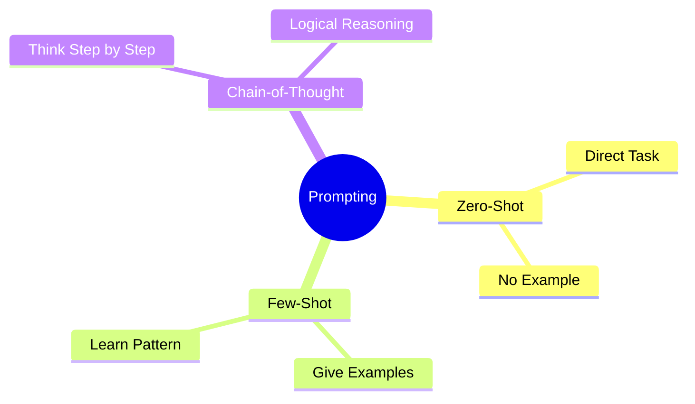

# 📊 Asset 1 — Prompt Flow





# 📊 Asset 2 — RCTF Framework





# 📊 Asset 3 — Vague vs Precise Prompt





# 📊 Asset 4 — Three Prompting Techniques





# 💻 Asset 5 — Prompt Examples


# Prompt Examples

## Zero-Shot

```text
Explain HTML.
```

---

## Few-Shot

```text
Example 1:
HTML → Structure

Example 2:
CSS → Styling

JavaScript → ?
```

---

## Chain-of-Thought

```text
Explain step by step how DNS works.
```
# 🌐 Asset 6 — Resources


# Useful Resources

## Prompt Engineering

- https://prompts.chat

## AI

- https://chatgpt.com

## Documentation

- https://www.markdownguide.org

## Mermaid

- https://mermaid.js.org
