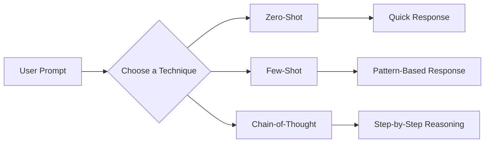

# 📚 Programming Hero – Smart Notes

| Information      | Details                                              |
| ---------------- | ---------------------------------------------------- |
| 🎯 **Milestone** | Milestone 0 – Welcome & AI Mindset                   |
| 📦 **Module**    | Module 0.6 – Beyond the Hype: How to Actually Use AI |
| 🎥 **Class**     | 0_6-4                                                |
| 📝 **Topic**     | The Art of Talking to AI – Prompt Engineering Basics |
| ⏱️ **Duration**  | 11 Minutes 16 Seconds                                |
| ⭐ **Difficulty** | Beginner                                             |

---

# 📖 Topics Covered

* Why communicating with AI matters
* What is a Prompt?
* The Four Parts of a Strong Prompt
* CREATE Prompt Pattern
* RCTF Framework
* Vague Prompt vs Precise Prompt
* Three Core Prompting Techniques
* Practice Prompt Examples
* Useful Prompt Resource

---

# 🎯 Learning Objectives

After completing this class, you should be able to:

* Understand why prompt quality directly affects AI-generated responses.
* Explain what a prompt is and why it is important.
* Write clear, structured, and effective prompts.
* Apply the **Role–Context–Task–Format (RCTF)** framework.
* Understand the CREATE prompt pattern.
* Distinguish between vague and precise prompts.
* Use different prompting techniques based on different situations.

---

# 🤖 1. Talking to AI

Artificial Intelligence (AI) is an incredibly powerful tool, but it **cannot read your mind**.

It only understands the instructions you provide.

That means the quality of the AI's response depends heavily on the quality of your prompt.

One of the most common principles in computer science is:

> **Garbage In, Garbage Out (GIGO)**

This means:

* Poor input usually produces poor output.
* High-quality input usually produces high-quality output.

The same principle applies to AI.

If your prompt is unclear, incomplete, or ambiguous, the AI has to make assumptions. As a result, the response may not match what you actually wanted.

On the other hand, a clear and detailed prompt gives the AI enough information to generate a much more accurate response.

---

## 🚗 Your Prompt is the Steering Wheel

Imagine AI as a powerful sports car.

The engine is already capable of incredible performance.

However, without a steering wheel, the car cannot reach the correct destination.

Your prompt works exactly like the steering wheel.

> **"Your prompt is the steering wheel."**

A good prompt guides the AI toward the exact output you want.

---

## 📌 Example

### ❌ Weak Prompt

```text
Teach me JavaScript.
```

Possible Problems:

* Too broad
* No target audience
* No learning style
* No expected output format

The AI has to guess what you actually want.

---

### ✅ Better Prompt

```text
Teach me JavaScript as if I am a complete beginner.

Start with variables.

Explain everything using simple English.

Include real-life examples.

Provide small coding examples.

End each section with one practice question.
```

Now the AI clearly understands:

* 👤 Who the learner is
* 🎯 What to teach
* 📖 How to explain
* 📝 What output format to follow

As a result, the response becomes much more useful and personalized.

---

## 💡 Best Practice

Whenever you write a prompt, ask yourself:

* Who am I?
* What do I want?
* What information should AI know?
* How should the answer be presented?

If these questions are answered in your prompt, the AI can usually provide a much better response.

---

# ✨ 2. What is a Prompt?

A **Prompt** is the instruction or request you provide to an AI model.

It tells the AI:

* **What** to do.
* **How** to do it.
* **Who** the response is for.
* **What type of output** you expect.

In simple words:

> **Prompt = Instruction for AI**

The clearer your instruction is, the easier it becomes for the AI to understand your intention.

---

## 📌 Example

Instead of writing:

```text
Explain CSS.
```

Write:

```text
Explain CSS for a complete beginner.

Use simple English.

Provide real-life examples.

Include a comparison table between CSS and HTML.

End with five practice questions.
```

The second prompt gives the AI much more context, leading to a more focused and useful response.

---

## 💡 Key Insight

Think of AI as a very intelligent assistant.

It is capable of doing many things—but only if you clearly explain what you need.

The AI is not responsible for guessing your intention.

**Your job is to provide clear instructions.**

---

# 🧩 The Four Parts of a Strong Prompt

Most effective prompts contain four essential components.

These components help reduce ambiguity and guide the AI toward the desired output.

---

## 1️⃣ Role

Tell the AI **who it should act as**.

This helps the AI adopt the appropriate perspective and expertise.

### Example

```text
Act as a Senior Frontend Developer.
```

or

```text
You are an experienced Programming Instructor.
```

---

## 2️⃣ Context

Provide background information about your situation.

Context allows the AI to understand your needs before generating an answer.

### Example

```text
I am a beginner learning HTML and CSS.

I have no previous programming experience.
```

Without context, the AI has to make assumptions.

---

## 3️⃣ Task

Clearly describe what you want the AI to do.

Avoid vague instructions.

### Example

```text
Explain CSS Flexbox from beginner to intermediate level.
```

A clear task produces a clearer response.

---

## 4️⃣ Format

Specify how you want the output to be presented.

For example:

```text
Use Markdown.

Include headings.

Add code examples.

Provide a comparison table.

End with a summary.
```

Specifying the format saves time because you won't need to ask the AI to reorganize its response later.

---

## 📋 Putting Everything Together

A complete prompt might look like this:

```text
Act as an experienced Frontend Developer.

I am a complete beginner learning HTML and CSS.

Teach me CSS Grid from basic to intermediate level.

Use simple English.

Include real-life examples.

Provide diagrams if possible.

End with five practice questions and a summary.
```

This prompt includes:

| Component | Included |
| --------- | -------- |
| ✅ Role    | Yes      |
| ✅ Context | Yes      |
| ✅ Task    | Yes      |
| ✅ Format  | Yes      |

Because all four components are present, the AI has enough information to generate a high-quality response.

---

## 📌 Key Takeaways (Part 1)

* AI responds based on the quality of your prompt.
* **Garbage In, Garbage Out (GIGO)** also applies to AI.
* Your prompt acts as the **steering wheel** that guides the AI.
* A prompt is simply an instruction given to an AI model.
* Strong prompts generally include four key elements:

  * **Role**
  * **Context**
  * **Task**
  * **Format**

---


# 🎯 3. CREATE Prompt Pattern

Writing a good prompt is more than simply asking a question.

A well-structured prompt provides enough information for the AI to understand your intention and generate the most useful response.

One popular approach is the **CREATE Prompt Pattern**.

> **Note:** There isn't a single universal definition of the CREATE framework. Different AI educators may explain it differently. However, the main idea remains the same—**write prompts with clarity, context, and enough details for the AI to understand your request.**

---

## 📝 A CREATE-Style Prompt Usually Includes

* 🎯 A clear objective
* 📖 Relevant background information
* 👤 The target audience or role
* 💡 Examples (if necessary)
* 📋 The expected output format
* ⚙️ Any additional instructions or constraints

Instead of writing a short sentence, you provide the AI with enough guidance to produce better results.

---

## ❌ Weak Prompt

```text
Write an article about JavaScript.
```

---

## ✅ CREATE-Style Prompt

```text
Act as a professional technical writer.

Write a beginner-friendly article about JavaScript.

Target audience:
Students who have never programmed before.

Requirements:

- Explain in simple English.
- Use real-life analogies.
- Include code examples.
- Use Markdown headings.
- End with a short summary.
```

The second prompt provides much more information, allowing the AI to generate a higher-quality response.

---

## 💡 Best Practice

When writing prompts, think beyond the question itself.

Ask yourself:

* What is my goal?
* Who is the audience?
* What information does the AI need?
* How should the answer be organized?

The more useful context you provide, the better the AI can assist you.

---

# 🧠 4. RCTF Framework

The **RCTF Framework** is one of the easiest ways to create clear and effective prompts.

It consists of four simple components:

| Letter | Meaning | Purpose                                            |
| ------ | ------- | -------------------------------------------------- |
| **R**  | Role    | Tell the AI who it should act as.                  |
| **C**  | Context | Explain your background or situation.              |
| **T**  | Task    | Clearly define what you want the AI to do.         |
| **F**  | Format  | Specify how you want the response to be presented. |

---

## 1️⃣ Role

Tell the AI what role it should take.

### Example

```text
You are an experienced Software Engineer.
```

or

```text
Act as a Programming Mentor.
```

This helps the AI respond from the appropriate perspective.

---

## 2️⃣ Context

Provide the necessary background information.

### Example

```text
I am learning Full Stack Web Development.

I already know HTML and CSS.

Now I want to learn JavaScript.
```

Without context, the AI has to make assumptions.

---

## 3️⃣ Task

Describe exactly what you want the AI to do.

### Example

```text
Explain JavaScript Functions from beginner to intermediate level.
```

Avoid vague instructions like:

```text
Explain JavaScript.
```

A specific task produces a more focused answer.

---

## 4️⃣ Format

Tell the AI how the response should be organized.

### Example

```text
Use Markdown.

Include headings.

Provide examples.

Create a comparison table.

End with five practice questions.
```

This saves time and reduces the need for follow-up prompts.

---

## 📋 Complete Example Using RCTF

```text
Role:
You are a Senior Frontend Developer.

Context:
I am a beginner learning JavaScript.

Task:
Teach me JavaScript Functions from basic to intermediate level.

Format:
Use simple English.
Include code examples.
Add real-life analogies.
Finish with practice questions.
```

---

## 🎯 Why RCTF Works

The framework removes ambiguity.

Instead of forcing the AI to guess your intention, you clearly explain what you need.

As a result, the response becomes:

* More accurate
* More organized
* More personalized
* Easier to understand

---

# ⚖️ 5. Same Goal, Different Output

Two prompts may ask for the same thing but produce completely different results.

The difference is not the AI.

The difference is **how the prompt is written.**

---

## ❌ Vague Prompt

```text
Create a routine.
```

Possible Problems:

* Routine for whom?
* Student or employee?
* Morning or night?
* Study or fitness?
* Daily or weekly?

The AI has to guess all of these details.

---

## ✅ Precise Prompt

```text
Create a daily routine for a beginner Full Stack Web Development student.

Study Time:
5 hours per day

Include:

- HTML/CSS practice
- JavaScript learning
- Project work
- Revision
- Exercise
- Breaks
- Sleep

Present everything in a table.
```

This prompt leaves very little room for confusion.

The AI knows exactly what is expected.

---

# 📊 Vague Prompt vs Precise Prompt

| Vague Prompt                     | Precise Prompt                                  |
| -------------------------------- | ----------------------------------------------- |
| Short and general                | Detailed and specific                           |
| Missing context                  | Provides background information                 |
| AI must guess                    | AI understands the request clearly              |
| Generic output                   | Personalized output                             |
| Often requires follow-up prompts | Usually produces a useful answer in one attempt |

---

## 💡 Best Practices for Better Prompts

✔ Clearly define your objective.

✔ Provide enough context.

✔ Mention the target audience when relevant.

✔ Specify the desired output format.

✔ Break complex tasks into smaller instructions.

✔ Review your prompt before submitting it.

---

## ⚠️ Common Mistakes

❌ Writing only one short sentence.

❌ Assuming the AI already knows your situation.

❌ Forgetting to specify the output format.

❌ Asking multiple unrelated questions in a single prompt.

❌ Using vague instructions like:

```text
Explain everything.
```

Instead, ask for exactly what you need.

---

## 📌 Key Takeaways (Part 2)

* The **CREATE Prompt Pattern** encourages writing prompts with enough clarity and structure.
* The **RCTF Framework** (Role, Context, Task, Format) is a simple and effective way to write better prompts.
* A detailed prompt almost always produces better results than a vague one.
* Providing context reduces ambiguity and helps the AI generate more accurate responses.
* A well-written prompt saves time by reducing the need for multiple follow-up questions.

---


## 🚀 Three Core Prompting Techniques

Writing a good prompt is important, but **different situations require different prompting techniques**.

A single prompting method does not work best for every task. Depending on the complexity of the problem and the type of response you expect, you should choose the appropriate prompting technique.

In this class, three fundamental prompting techniques were introduced:

- Zero-Shot Prompting
- Few-Shot Prompting
- Chain-of-Thought (CoT) Prompting

> [!NOTE]
> Choosing the right prompting technique can significantly improve the quality, clarity, and accuracy of AI-generated responses.

---

## 1. Zero-Shot Prompting

### 📖 Definition

**Zero-Shot Prompting** is a technique where you ask the AI to perform a task **without providing any examples**.

The AI relies entirely on its existing knowledge to generate the response.

### ✅ When to Use

Use Zero-Shot Prompting when:

- The task is simple.
- You need a quick explanation.
- No specific writing style is required.
- The AI already has enough knowledge about the topic.

### 💻 Example

```text
Explain how the Internet works.
```

### 📝 Explanation

In this example, no sample or reference is provided.

The AI directly explains the topic based on its knowledge.

This is the simplest and most commonly used prompting technique.

> [!TIP]
> Zero-Shot Prompting works best for definitions, general concepts, and straightforward questions.

---

## 2. Few-Shot Prompting

### 📖 Definition

**Few-Shot Prompting** is a technique where you provide one or more examples before asking the AI to perform a similar task.

These examples help the AI understand the expected pattern, style, or format.

### ✅ When to Use

Use Few-Shot Prompting when:

- You want consistent formatting.
- You need a specific writing style.
- The output should follow a particular pattern.
- Similar examples can guide the AI.

### 💻 Example

```text
Example 1:
Apple → Fruit

Example 2:
Carrot → Vegetable

Now classify:

Mango → ?
```

### 📝 Explanation

The examples teach the AI how to approach the task before generating the final answer.

As a result, the response is usually more accurate and consistent.

> [!TIP]
> Few-Shot Prompting is especially useful for classification, content generation, formatting, and style replication.

---

## 3. Chain-of-Thought (CoT) Prompting

### 📖 Definition

**Chain-of-Thought (CoT) Prompting** encourages the AI to solve a problem by explaining its reasoning step by step before providing the final answer.

Instead of jumping directly to the solution, the AI breaks the problem into smaller logical steps.

### ✅ When to Use

Use Chain-of-Thought Prompting when:

- Solving complex problems.
- Understanding logical reasoning.
- Learning difficult concepts.
- Breaking down multi-step tasks.

### 💻 Example

```text
Explain step by step how the Internet works.
```

or

```text
Think step by step before solving this problem.
```

### 📝 Explanation

Adding phrases like **"step by step"** encourages the AI to organize its reasoning before answering.

This often results in more structured, detailed, and logical responses.

> [!IMPORTANT]
> Chain-of-Thought Prompting is particularly effective for programming, mathematics, problem solving, and analytical tasks.

---

## 📊 Comparison of Prompting Techniques

| Technique | Examples Required | Best For | Complexity |
|-----------|-------------------|----------|------------|
| Zero-Shot | ❌ No | Simple questions, definitions | Low |
| Few-Shot | ✅ Yes | Pattern-based tasks, consistent formatting | Medium |
| Chain-of-Thought | Optional | Reasoning, problem solving, complex topics | High |

---

## 🧩 Visual Representation



---

## 🌍 Real-Life Examples

### Example 1 — Zero-Shot

```text
Explain what HTML is.
```

---

### Example 2 — Few-Shot

```text
Example 1:
HTML → Structure

Example 2:
CSS → Styling

Now classify:

JavaScript → ?
```

---

### Example 3 — Chain-of-Thought

```text
Explain step by step how a browser loads a website after entering a URL.
```

---

## 💡 Best Practices

- Choose the prompting technique based on the complexity of the task.
- Keep prompts clear and specific.
- Provide examples only when they add value.
- Ask for step-by-step reasoning when solving complex problems.
- Review and refine your prompt if the first response is not satisfactory.

---

## ⚠️ Common Mistakes

> [!WARNING]
> Avoid these common mistakes when writing prompts.

- Asking very broad questions without context.
- Expecting detailed answers from extremely short prompts.
- Using Few-Shot Prompting without providing meaningful examples.
- Using Chain-of-Thought Prompting for very simple questions where it is unnecessary.

---

## 📌 Key Insight

> [!TIP]
> There is **no single "best" prompting technique**. The most effective technique depends on the task you want the AI to perform.

---

## 📝 Quick Revision

- **Zero-Shot** → No examples; direct instruction.
- **Few-Shot** → Learn from examples before answering.
- **Chain-of-Thought** → Think and explain step by step before producing the final answer.

Remember:

**Better Technique + Better Prompt = Better AI Response**


## 📝 Practice Questions

Test your understanding by writing prompts for the following tasks.

### Practice 1 — Explain a Concept

Write a prompt that asks an AI to explain **how the Web works** using simple language and real-life examples.

---

### Practice 2 — Step-by-Step Explanation

Write a prompt that asks an AI to explain **how the Internet works** step by step.

---

### Practice 3 — Daily Study Routine

Write a prompt that asks an AI to create a daily routine for a beginner Full Stack Web Development student.

Your prompt should include:

- Available study time
- Coding practice
- Revision
- Project time
- Breaks
- Exercise
- Sleep schedule

Ask the AI to present the routine in a **table format**.

---

## 🌐 Recommended Resource

### Prompts.chat

**Prompts.chat** is a website that provides ready-made prompt ideas for different AI tools and use cases.

You can explore prompts for:

- Programming
- Writing
- Learning
- Marketing
- Business
- Productivity
- Image Generation
- And many more

> [!TIP]
> Don't copy prompts blindly. Read them, understand how they're structured, and customize them for your own needs.

---

## 📌 Key Takeaways

After completing this lesson, you should understand that:

- A prompt is an instruction given to an AI.
- Better prompts generally produce better results.
- A strong prompt usually includes:
  - Role
  - Context
  - Task
  - Format (RCTF)
- Clear and specific prompts are more effective than vague ones.
- Different prompting techniques are suitable for different types of tasks.
- Prompt Engineering is a practical skill that improves with regular practice.

---

## ⚡ Quick Revision

| Concept | Summary |
|---------|---------|
| Prompt | An instruction given to an AI |
| RCTF | Role + Context + Task + Format |
| Zero-Shot | Direct instruction without examples |
| Few-Shot | Uses examples to guide the AI |
| Chain-of-Thought | Encourages step-by-step reasoning |

---

## 📚 Summary

Prompt Engineering is the skill of communicating effectively with AI.

Instead of asking short or vague questions, you should write clear, structured, and goal-oriented prompts.

By understanding frameworks like **RCTF** and techniques such as **Zero-Shot**, **Few-Shot**, and **Chain-of-Thought Prompting**, you can generate more accurate, organized, and useful AI responses.

Like programming, Prompt Engineering is a skill that improves through continuous practice and experimentation.

---

## 🚀 What's Next?

In the next class, we'll continue learning how to communicate more effectively with AI and explore additional concepts that help us get better results from AI tools.

---

## 📄 Document Information

| Field | Value |
|-------|-------|
| **Document Version** | v1.0 |
| **Status** | ✅ Completed |
| **Last Updated** | 30 June 2026 |
| **Maintained By** | Afia A. |
