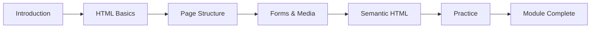

| Information | Details |
|------------|---------|
| 📦 Module | 1 |
| 📚 Title | Frontend Basics: HTML |
| 🚀 Status | In Progress |
| 📅 Started | 30 June 2026 |
| 🎯 Goal | Build a strong HTML foundation |

# 📘 Module 1 — Frontend Basics: HTML

> [!IMPORTANT]
> Welcome to the first learning module of the **AI-Driven Full Stack Web Engineering** journey.

---

## 🎯 Module Goal

By the end of this module, you will understand the fundamentals of HTML and learn how to build the structure of a web page using modern HTML5.

---

## 📚 What You'll Learn

- Introduction to the Web
- Introduction to HTML
- Creating Your First HTML Document
- HTML Document Structure
- Headings & Paragraphs
- Text Formatting
- Lists
- Links
- Images
- HTML Forms
- Tables
- Semantic HTML
- Audio & Video
- Comments
- Practice Tasks
- Module Recap

---

## 🛠️ Skills You'll Gain

After completing this module, you should be able to:

- Create a complete HTML document
- Build structured web pages
- Use semantic HTML elements
- Create forms
- Add images, audio, and video
- Write clean and readable HTML
- Follow basic web development best practices

---

## 📈 Learning Journey



---

## 💡 Learning Tips

> [!TIP]
>
> Don't just watch the videos.
>
> Write every piece of code yourself.

---

> [!TIP]
>
> Making mistakes while coding is completely normal.
>
> Debugging is one of the most important skills for every developer.

---

## 📂 Module Structure

```text
notes/
code/
resources/
```

---

## 🎯 Final Goal

This module is not just about learning HTML syntax.

It is about building a strong foundation for becoming a professional Full Stack Web Engineer.

Every topic you learn here will be used throughout the rest of the course.


> [!NOTE]
> Every professional developer started with a simple HTML file.
>
> Stay consistent, keep practicing, and remember that every line of code you write today is an investment in your future.
